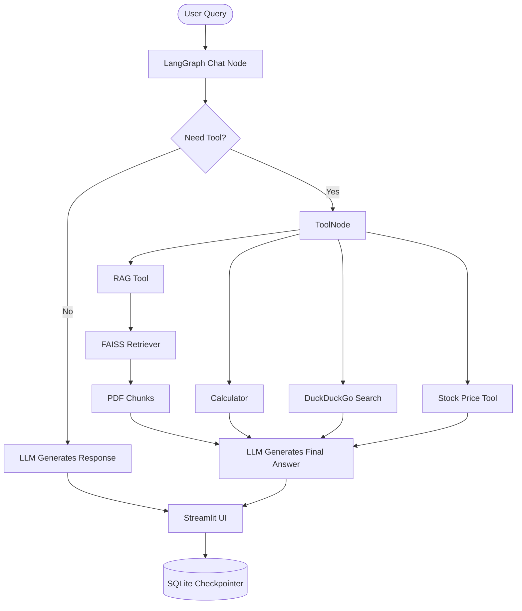

# 🤖 Multi Utility RAG Chatbot

> **A powerful AI chatbot built using LangGraph, LangChain, OpenRouter LLMs, Retrieval-Augmented Generation (RAG), and Streamlit.**
>
> Upload PDFs, search the web, perform calculations, retrieve stock prices, and have persistent multi-thread conversations through an intelligent tool-calling agent.

---

# ✨ Features

* 📄 Chat with your PDF documents using RAG
* 🌐 Real-time Web Search using DuckDuckGo
* 📈 Live Stock Price Retrieval
* 🧮 Built-in Calculator Tool
* 💾 Persistent Memory using SQLite Checkpointer
* 🧠 LangGraph Agent Workflow
* ⚡ Streaming AI Responses
* 🔍 Semantic Search using FAISS Vector Database
* 📝 Automatic PDF Chunking
* 🔄 Multiple Chat Threads
* 📚 Thread-specific Document Storage
* 💬 Conversation History
* 🎨 Clean Streamlit Interface

---

# 🏗️ Project Architecture

```text
                        User
                          │
                          ▼
                  Streamlit Frontend
                          │
                          ▼
                 User enters Query
                          │
                          ▼
                  LangGraph Workflow
                          │
             ┌────────────┴────────────┐
             │                         │
             ▼                         ▼
      LLM (Nemotron 120B)        Tool Decision
             │                         │
             │                         ▼
             │                 ToolNode (LangGraph)
             │                         │
             │      ┌──────────┬──────────┬────────────┐
             │      │          │          │            │
             ▼      ▼          ▼          ▼            ▼
        Direct Reply  Calculator  Web Search  Stock API  RAG Tool
                                                     │
                                                     ▼
                                          Thread-specific Retriever
                                                     │
                                                     ▼
                                              FAISS Vector Store
                                                     │
                                                     ▼
                                        PDF Loader + Text Splitter
                                                     │
                                                     ▼
                                              Uploaded PDF
```

---

# 🧠 Workflow



---

# 🛠️ Tech Stack

| Category        | Technology                                |
| --------------- | ----------------------------------------- |
| Frontend        | Streamlit                                 |
| Backend         | Python                                    |
| Agent Framework | LangGraph                                 |
| LLM Framework   | LangChain                                 |
| LLM             | NVIDIA Nemotron-3 Super 120B (OpenRouter) |
| Embeddings      | OpenAI text-embedding-3-small             |
| Vector Database | FAISS                                     |
| PDF Loader      | PyPDFLoader                               |
| Text Splitter   | RecursiveCharacterTextSplitter            |
| Search Tool     | DuckDuckGo                                |
| Database        | SQLite                                    |
| Memory          | LangGraph SqliteSaver                     |
| APIs            | Alpha Vantage, OpenRouter                 |
| Environment     | dotenv                                    |

---

# 📂 Folder Structure

```
.
├── chatbot_rag_backend.py
├── chatbot_rag_frontend.py
├── chatbot.db
├── requirements.txt
├── .env
├── README.md
```

---

# ⚙️ Installation

## Clone Repository

```bash
git clone https://github.com/yourusername/chatbot-rag.git

cd chatbot-rag
```

---

## Create Virtual Environment

```bash
python -m venv venv
```

Activate it

Windows

```bash
venv\Scripts\activate
```

Linux / Mac

```bash
source venv/bin/activate
```

---

## Install Dependencies

```bash
pip install -r requirements.txt
```

---

## Configure Environment Variables

Create a **.env**

```env
OPENROUTER_API_KEY=YOUR_OPENROUTER_API_KEY
```

---

## Run

```bash
streamlit run chatbot_rag_frontend.py
```

---

# 📄 PDF Retrieval Pipeline

```
Upload PDF
      │
      ▼
PyPDFLoader
      │
      ▼
RecursiveCharacterTextSplitter
      │
      ▼
OpenAI Embeddings
      │
      ▼
FAISS Vector Store
      │
      ▼
Retriever
      │
      ▼
LLM Response
```

---

# 🔧 Available Tools

### 📄 PDF RAG

* Upload PDF
* Semantic Search
* Context Retrieval
* Source-aware Answers

---

### 🌐 Web Search

* DuckDuckGo Search
* Internet Queries
* Current Information

---

### 📈 Stock Price

* Alpha Vantage API
* Live Stock Prices

Example:

```
AAPL
TSLA
MSFT
NVDA
```

---

### 🧮 Calculator

Supports

* Addition
* Subtraction
* Multiplication
* Division

Example

```
25 * 16

100 / 4

15 + 92
```

---

# 💾 Persistent Memory

The chatbot uses

* SQLite Database
* LangGraph Checkpointer

which enables

* Conversation persistence
* Multiple chat threads
* Previous conversation retrieval

---

# 🚀 Highlights

✅ Multi-tool AI Agent

✅ Retrieval-Augmented Generation (RAG)

✅ Persistent Memory

✅ Streaming Responses

✅ Multi-thread Chat Sessions

✅ Semantic PDF Search

✅ Modular Architecture

✅ LangGraph Agent Workflow

---

# 📸 Screenshots

Add screenshots here

```
images/
├── home.png
├── pdf_chat.png
├── web_search.png
├── stock_tool.png
├── calculator.png
```

---

# 🔮 Future Improvements

* Authentication
* Chat Export
* Image Understanding
* Voice Chat
* OCR Support
* Multi-PDF Retrieval
* Hybrid Search
* Conversation Summarization
* Citation Support
* Docker Deployment

---

# 👨‍💻 Author

**Amrit**

B.Tech | Mechatronics & Automation Engineering

IIIT Bhagalpur

Passionate about AI, Machine Learning, LLMs, RAG Systems, and Intelligent Agentic Workflows.

---

# ⭐ If you found this project useful

Give this repository a ⭐ on GitHub!

It helps others discover the project and motivates future improvements.
